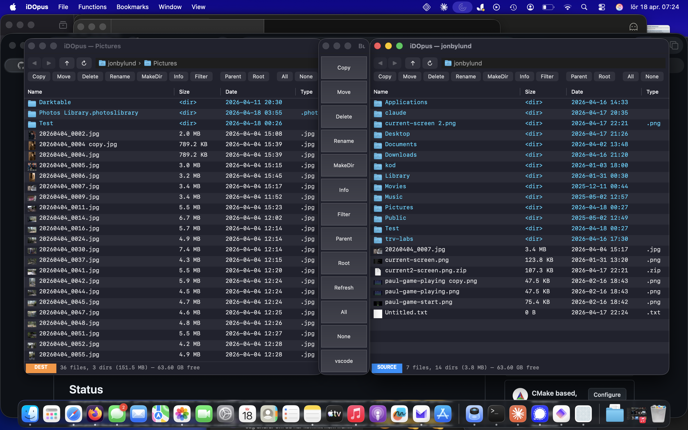

# iDOpus

**A modern macOS file manager, ported from the legendary Directory Opus 5 Magellan (Amiga, 1995).**

iDOpus brings the classic dual-pane file manager experience from the Commodore Amiga to modern macOS on Apple Silicon. The original Directory Opus 5 Magellan was released as open source under the AROS Public License in 2012, and this project builds on that codebase.



## Status: 1.0

All the core DOpus workflows are in place. iDOpus is a daily-driver dual-pane file manager with a Button Bank, source/destination Listers, full file operations with progress, conflict resolution including folder merge, drag-drop, Quick Look, file type actions, and more. See the complete feature list below.

Still planned for future versions: FTP/SMB, content (grep-style) search, Apple Developer ID signing + notarization, scripting bridge.

## Download & install (macOS, Apple Silicon)

1. Grab the latest `.dmg` from [**Releases**](https://github.com/bamsejon/idopus/releases/latest).
2. Open the `.dmg` and drag **iDOpus.app** to **Applications**.
3. First launch: because the app is ad-hoc signed (not Apple-notarized), macOS Gatekeeper needs a one-time bypass. **Right-click** iDOpus in Applications and choose **Open**, then confirm.
   From Terminal, equivalent:
   ```
   xattr -dr com.apple.quarantine /Applications/iDOpus.app
   ```

Optional — to skip all macOS TCC privacy prompts ("iDOpus wants to access your Documents folder…"):
System Settings → Privacy & Security → **Full Disk Access** → `+` → `/Applications/iDOpus.app`.

Requires macOS 13 (Ventura) or later on Apple Silicon (M1/M2/M3/M4).

## Features

### Listers (the dual-pane workspace)
- Two tiled Listers on launch with a Button Bank docked between them — classic DOpus Magellan layout
- Each Lister is **SOURCE** / **DEST** / **OFF** (mirrors Amiga `LISTERF_SOURCE` / `LISTERF_DEST`). Focusing a Lister promotes it to SOURCE; the previous SOURCE demotes to DEST.
- Columns: Name, Size, Date, Type — click to sort, click again to reverse
- **Real file icons** (via NSWorkspace) and **Quick Look thumbnails** (images / PDFs / videos) render asynchronously, cached per-file
- Breadcrumb path bar: click any segment to jump to that ancestor
- Navigation history (Back / Forward per Lister, ⌘[ / ⌘])
- Inline rename (F3, single selection)
- Type-to-find: type letters in the file list to jump to matching entries
- Tabs via native macOS window tabbing (⌘T, ⌃Tab / ⌃⇧Tab)
- Split Display (⇧⌘N) halves the current Lister and opens a new one beside it

### File operations
- **Copy** / **Move** with a progress sheet per operation, cancellable, runs on a background queue so the UI stays responsive
- **Conflict dialog**: Replace / Skip / Keep Both / Cancel All / **Merge** (for dir-on-dir)
- Non-destructive **folder merge** recursively fills in missing items without overwriting
- **Delete** to Trash (or permanent, toggle in Preferences) with confirmation
- **Rename** (inline on F3, dialog for multi)
- **MakeDir**, **New File…**, **Duplicate**
- **Copy to… / Move to…** with a folder picker (no need for a second Lister)
- **Compress** (zip via ditto, preserves macOS metadata) and **Extract** (zip / tar.gz / tar / gz)
- **Info**: path, kind, size + **recursive size** for folders, permissions, owner, timestamps
- **Drag-and-drop** between Listers (Copy; Option = Move) and to/from Finder, the Dock, Trash

### Button Bank (Magellan-style floating panel)
- Docked between the two Listers, full height
- Built-in buttons: Copy · Move · Delete · Rename · MakeDir · Info · Filter · Parent · Root · Refresh · All · None
- **Custom shell-command buttons** with `{FILES}` / `{PATH}` placeholders (`Add Custom Button…`)
- Help ⓘ with examples (opening Mac apps, running CLI tools, handling filenames)
- Non-activating — clicking a button never steals focus from the SOURCE Lister, so copy/move semantics stay stable

### File type actions (per-extension shell actions)
- `Add File Type Action…`: extension + title + shell command + optional default
- **Choose App…** auto-fills `open -a "App Name" {FILE}` — no need to type the command
- Extension pre-fills from your current selection
- Double-click runs the extension's default action; right-click → **Actions** submenu lists all defined actions

### Filtering & selection
- **Filter** (⇧⌘F): Show pattern, Hide pattern, Hide dotfiles (glob syntax)
- **Find** (⌘F): live incremental search within the current directory
- **Select By Pattern** (⇧⌘A): glob-based multi-select
- **Compare With Destination**: select source items that don't exist in dest (classic DOpus feature)

### Navigation
- **Bookmarks** menu with built-in locations (Home, Desktop, Documents, Downloads, Applications, Pictures, Movies, Music) and user entries
- **Devices** section lists user-visible mounted volumes (APFS system containers hidden)
- **Go to Path…** (⌘L) dialog with tilde expansion
- **Reveal in Finder**, **Open in Terminal** from right-click

### Polish
- **Auto-refresh** via FSEvents — any external filesystem change updates the Lister automatically
- **Selection preserved** across reloads so background changes don't wipe what you marked
- **Persisted state**: last-open paths, column widths, hidden columns, custom buttons, bookmarks, file type actions
- **Status bar** with selection info: `5 selected (24.3 KB) | 14 files, 29 dirs (463.9 MB) — 64.68 GB free`
- **Preferences** (⌘,) for hide-dotfiles default, restore paths, dual-pane at launch, Button Bank visibility, Trash vs permanent delete, reset-all
- **Ad-hoc code signing** so TCC grants persist across installs

## Keyboard reference

| Key | Action |
|---|---|
| `F3` | Rename (inline for single selection) |
| `F5` | Copy (source → dest) |
| `F6` | Move (source → dest) |
| `F7` | MakeDir |
| `F8` | Delete (Trash or permanent) |
| `F9` | Info |
| `Space` | Quick Look |
| `Return` | Open / enter folder |
| `Backspace` | Parent directory |
| `⌘N` | New Lister |
| `⇧⌘N` | Split Display |
| `⌥⌘N` | New File… |
| `⌘T` | New Tab |
| `⌃Tab` / `⌃⇧Tab` | Next / previous tab |
| `⌘W` | Close |
| `⌘[` / `⌘]` | Back / Forward |
| `⌘L` | Go to Path… |
| `⌘F` | Find (incremental search) |
| `⇧⌘F` | Filter… |
| `⇧⌘A` | Select By Pattern… |
| `⌘B` | Show / Hide Button Bank |
| `⌘.` | Toggle hidden files |
| `⌘D` | Add Current Bookmark |
| `⌘,` | Preferences |

Drag between Listers = Copy; hold `⌥` (Option) while dragging = Move.

## Background

Directory Opus was *the* file manager on Amiga. First released in 1990 by Jonathan Potter / GP Software, it became the gold standard for file management — a dual-pane, fully customizable powerhouse that made the Amiga's Workbench feel primitive in comparison.

Version 5 ("Magellan") was the pinnacle: it could replace Workbench entirely, acting as a complete desktop environment with Lister windows, button banks, ARexx scripting, FTP integration, and a modular architecture.

Today, macOS still lacks a truly great dual-pane file manager in the spirit of DOpus. This project aims to change that.

## Origin

The source is derived from [Directory Opus 5.82 Magellan](https://github.com/MrZammler/opus_magellan), released under the AROS Public License (APL v1.1, based on Mozilla Public License) by GP Software in 2012 via the [power2people.org](https://power2people.org/projects/dopus-magellan/) bounty program.

### Trademark notice

"Directory Opus" is a registered trademark of GP Software. The trademark is licensed for use on Amigoid platforms (AROS, AmigaOS, MorphOS) only. This macOS port uses the name **iDOpus** and is not affiliated with or endorsed by GP Software. The commercial [Directory Opus for Windows](https://www.gpsoft.com.au/) (currently v13) is a separate product.

## Architecture

Clean-room port guided by the original source in `original-amiga-source/`. Amiga subsystems are replaced by their macOS equivalents rather than emulated.

| Amiga layer | macOS replacement | Status |
|---|---|---|
| `exec.library` (memory, IPC, signals) | `malloc`/GCD/`pthread_mutex` via PAL | ✅ |
| `dos.library` (file I/O, paths, patterns) | POSIX + Foundation via PAL | ✅ |
| Intuition / BOOPSI GUI | AppKit (`NSWindow`, `NSTableView`, `NSPanel`) | ✅ |
| DOpus Lister + source/dest model | `ListerWindowController` state | ✅ |
| DOpus Button Bank | floating non-activating `NSPanel` | ✅ (+ user-custom buttons) |
| DOpus file types + actions | per-extension shell commands stored in defaults | ✅ |
| `graphics.library` rendering | CoreGraphics / AppKit via NSTableView | ✅ |
| 68K assembler fragments | Removed / rewritten in C | N/A |
| SAS/C 6 compiler | Clang / Xcode | ✅ |
| Preferences | Preferences panel + `NSUserDefaults` | ✅ |
| Quick Look preview | QLPreviewPanel + QLThumbnailGenerator | ✅ |
| Filesystem watch | FSEventStream | ✅ |
| FTP / SMB modules | — | ⏳ planned |
| ARexx scripting | AppleScript bridge / embedded Lua | ⏳ planned |
| Modules (viewer, print, …) | macOS bundles (`.bundle` + dlopen) | ⏳ planned |

See [docs/PORTING_ANALYSIS.md](docs/PORTING_ANALYSIS.md) for the deeper porting plan.

## Building from source

Requires Xcode Command Line Tools and CMake (3.20+).

```
cmake -S . -B build
cmake --build build
open build/iDOpus.app
```

Run the PAL and core test suites:

```
./build/pal_test
./build/core_test
```

Produce an ad-hoc-signed `.dmg` in `dist/`:

```
./scripts/package.sh
```

## License

Source code is licensed under the **AROS Public License v1.1** (APL), based on the Mozilla Public License v1.1. See [LICENSE](LICENSE) for full text.

Original source copyright (c) GP Software / Jonathan Potter.
macOS port and modifications copyright (c) 2026 Jon Bylund.

## Contributing

iDOpus is an opinionated port of a 30-year-old Amiga file manager. If that's your kind of project, pull requests and issues are very welcome — especially for FTP, scripting, or additional DOpus modules.

## Credits

- **Jonathan Potter / GP Software** — original author of Directory Opus
- **MrZammler et al.** — maintaining the open source Amiga version
- **power2people.org** — funded the open source release in 2012
- **Claude Code** (AI agent) — assisting with the porting process
